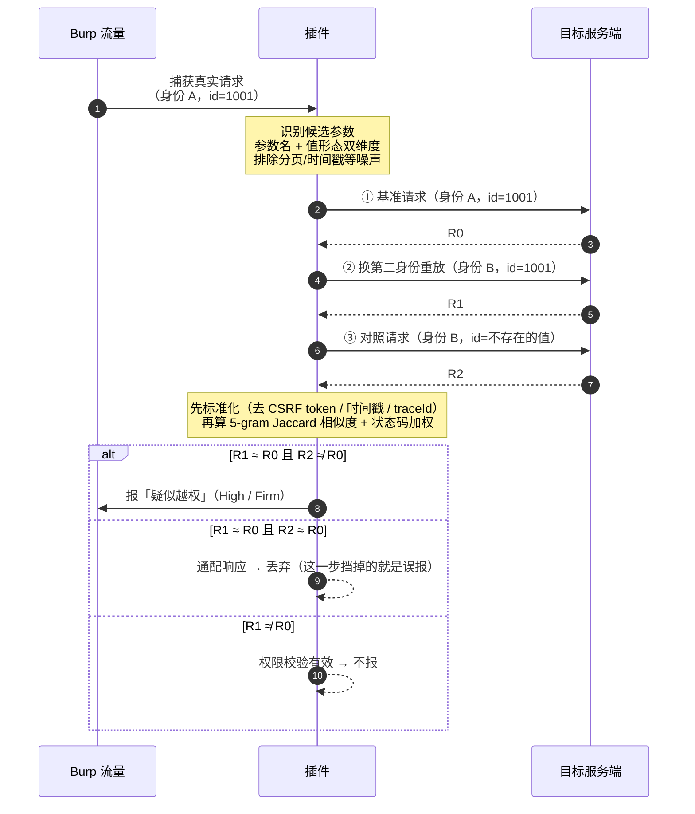
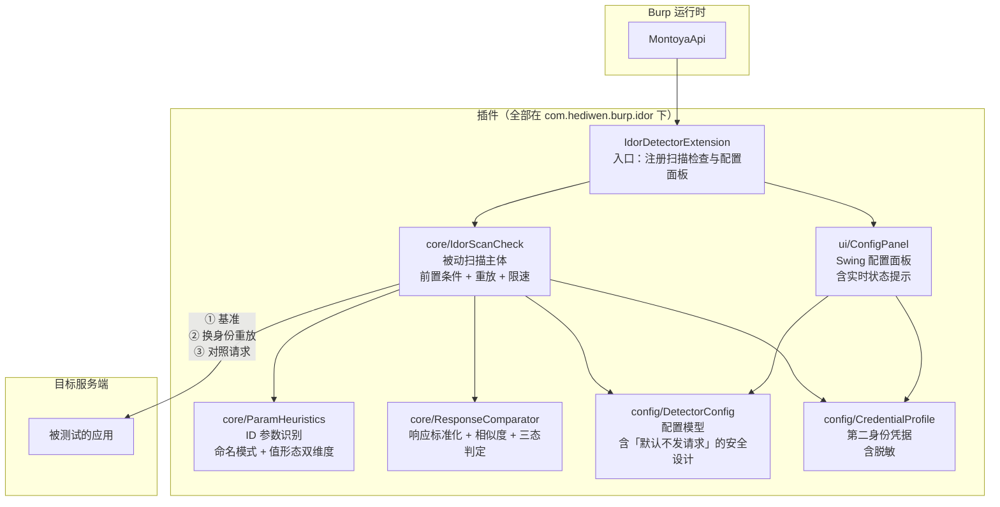

# Burp IDOR Detector

[](https://github.com/hediwen831-star/burp-idor-detector/actions/workflows/ci.yml)
[](https://github.com/hediwen831-star/burp-idor-detector/releases)
[](https://adoptium.net/)
[](#项目结构)
[](https://portswigger.net/burp/extensibility)
[](LICENSE)

> 越权访问（IDOR / 越权读他人数据）的自动化检测插件。
>
> 从 Burp 的流量里挑出「像资源标识的参数」，用**第二身份**重放，
> 通过**三态对比**判断服务端是否校验了资源归属。

```
Java 21 · Burp Montoya API 2026.7 · 零第三方依赖 · 单 jar 即插即用
```

---

## 为什么做这个

越权（IDOR）是 Web 和 API 里最高频的高危漏洞之一 —— 在 OWASP API Security Top 10
里长期位居 **API1: Broken Object Level Authorization**。

但它的检测方式一直很「手工」：改一个 ID、再发一次、看看返回了什么。
一个稍微大点的系统有几十个接口、上百个 ID 参数，人工逐个试不现实。

现有的辅助工具大多是**交互式**的（Autorize、AuthMatrix 等）：
需要手工配置、手工触发请求、人工看结果。
它们适合精测，不适合「先快速过一遍，找出值得深入的点」。

这个插件解决的是后一个问题。

---

## 检测流程



图中绿色的判断分支是全部价值所在 —— 下面详细说。

---

## 模块结构



**分层意图**：

- `core/` 是纯逻辑（参数识别、响应对比），**不依赖 Burp 运行时** ——
  所以能脱离 Burp 单独跑单元测试（94 个测试里绝大多数属于这一层）
- `config/` 承载状态与安全默认值，UI 和扫描逻辑都读它
- `ui/` 只负责配置，不碰扫描逻辑

这样做的好处是：**插件的行为如果只能在 Burp 里手工验证，就等于没有回归保护。**
把纯逻辑剥出来单测，是不让它退化的唯一办法。

---

## 三态对比的判定表

| R1 vs R0<br/>（换身份后） | R2 vs R0<br/>（对照请求） | 结论 | 说明 |
|---|---|---|---|
| 相似 | **不相似** | **疑似越权** | 资源真实存在，且服务端没校验归属 |
| 相似 | **相似** | 误报，丢弃 | 该接口对任何 ID 都返回固定内容 |
| 不相似 | 任意 | 权限校验有效 | 第二身份被正确拦截 |

---

## 检测原理：三态对比

光判断「换个身份还能看到同样的内容」是不够的 —— 因为**公开资源本来谁都能看**。
商品详情页、公开文章、帮助文档，用任何账号访问同一个 ID 都会返回相同内容。

所以这里引入第三个请求做对照：

```
① 原始请求（身份 A，id=1001）      → 基准响应 R0
② 换身份重放（身份 B，id=1001）    → 响应 R1
③ 对照请求（身份 B，id=999999999） → 响应 R2

判定：
  R1 ≈ R0  且  R2 ≉ R0   →  疑似越权
   · R1 ≈ R0：身份 B 拿到了和身份 A 一样的数据
   · R2 ≉ R0：ID 被换成一个不存在的值时返回了不同内容
              → 说明 id=1001 是真实存在的资源，不是「任何值都返回同样内容」

  R1 ≈ R0  且  R2 ≈ R0   →  误报，丢弃
   · 该接口对任何 ID 都返回固定内容（通配响应）
   · 此时前一步的「相似」毫无意义
```

**第 ③ 步是这个插件的核心。** 没有它，一个返回固定错误页的接口
就能刷出几百条「疑似越权」。

这个思路和 [ASP 攻击面平台](https://github.com/hediwen831-star/attack-surface) 里的
「负向对照校验」是同一件事：排除「检测特征被检测行为本身制造出来」的可能。

### 响应相似度怎么算

不能直接比字符串 —— 同一个接口两次请求，正文几乎不可能完全一致
（CSRF token、时间戳、traceId 都在变）。直接比较的结果是**全部判为不相似**，
所有越权都被漏掉。

所以流程是「先标准化，再结构化比较」：

| 步骤 | 做法 |
|---|---|
| **标准化** | 把 CSRF token / 会话 ID / 时间戳 / 长十六进制串替换成占位符，压缩空白 |
| **指纹化** | 提取状态码、Content-Type、正文的 5-gram 集合 |
| **相似度** | 加权组合：状态码 0.3 + Content-Type 0.1 + Jaccard 相似度 0.6 |

给状态码高权重是有原因的：302 跳转和 200 正常响应即使正文都为空，
语义也完全不同 —— 前者通常意味着「被踢到登录页了」，那其实是权限校验在起作用。

---

## ⚠️ 安全设计：默认不发送任何请求

这是这个插件最重要的一个设计决定。

**插件装上后只做被动观察** —— 识别哪些参数像 ID，记录到日志，不重放。
用户必须显式做两件事才会开始检测：

1. 配置第二身份（从 Burp 复制一条完整的鉴权请求头）
2. 勾选「启用主动重放」并保存

为什么这么做？一个在后台自动发请求的安全插件，风险不是漏检：

| 风险 | 后果 |
|---|---|
| **把目标打挂** | 一个列表页可能有几十个 ID 参数，乘以重放 + 对照，流量放大数倍。用户以为在正常浏览，实际在跑扫描 |
| **污染业务数据** | 如果检测到写接口，重放可能真的修改了数据 —— 这比漏检严重得多 |
| **打草惊蛇** | 授权测试有明确的窗口期和流量约定，插件擅自发请求属于越界 |

即使打开了开关，还有四道限制：

- **方法白名单**：只对 `GET` / `HEAD` / `OPTIONS` 生效。
  `POST` 也可能是查询（GraphQL、搜索接口），但它同样可能是「提交订单」——
  在无法区分的情况下，保守的做法是不碰。
- **限速**：默认两次请求间隔 100ms
- **单 host 配额**：默认最多 50 个候选，防止在中大型站点上刷出成百上千个请求
- **范围控制**：可选只检测 / 排除指定 host
- **凭据脱敏**：日志和 Issue 详情里只显示 `JSESSION****abcd` 形式

这与 ASP 项目里「Web 接口默认只绑 127.0.0.1、绑公网必须配 token」
是同一类取舍：工具的能力边界就是它的风险边界，默认值取安全的那一侧。

---

## 安装

### 方式一：下载预编译 jar

从 [Releases](https://github.com/hediwen831-star/burp-idor-detector/releases) 下载
`idor-detector-0.1.1.jar`，然后：

```
Burp Suite → Extensions → Installed → Add
  Extension type: Java
  Extension file: idor-detector-0.1.1.jar
```

### 方式二：自己编译

```bash
git clone https://github.com/hediwen831-star/burp-idor-detector.git
cd burp-idor-detector
mvn -s maven-settings.xml clean package
# 产物：target/idor-detector-0.1.1.jar
```

构建需要 JDK 21+。`maven-settings.xml` 里配了阿里云镜像 ——
国内直连 Maven Central 很慢，而这个镜像已收录 Burp Montoya API。

---

## 使用

1. 加载插件后，到 **IDOR Detector** 标签页
2. 填入第二身份：
   - **身份名称**：随便起个名字，如「受害者账号 B」
   - **请求头名**：`Cookie` 或 `Authorization` 或自定义头
   - **请求头值**：从 Burp 里复制那一条完整的头（只复制值，不含头名）
3. 勾选「启用主动重放」，点「保存配置」
4. 正常地浏览目标站点（或跑 Burp 的主动扫描）
5. 结果会出现在 **Dashboard → Issue activity**，类型为 `疑似越权访问（IDOR）`

**如何拿到第二身份的凭据**：用无痕窗口登录另一个账号，从 Burp 的
Proxy history 里找到那条请求，复制它的 `Cookie` / `Authorization` 头的值。

---

## 与现有工具的关系

同类插件已经存在，这里不声称任何「首创」。差异是具体的：

| 工具 | 交互方式 | 判定方式 | 本插件的差异 |
|---|---|---|---|
| **Autorize** | 手动：配好身份后开始拦截，逐条人工查看 | 对比响应（可配过滤规则） | 本插件**自动**从流量里挑候选参数，不需要人工逐条触发 |
| **AuthMatrix** | 手动：定义角色 × 请求的矩阵 | 人工填表判定 | 本插件自动判定并给出**量化的相似度数值** |
| **Authz** | 手动配置 | 对比响应 | 本插件多了**对照请求**这一步 |

本插件真正的差异点是第 ③ 步对照请求。
Autorize 这类工具的一个已知痛点是误报：遇到「任何 ID 都返回固定内容」的接口时，
它们会报出大量假阳性，用户需要人工排除。

本插件用「不存在的 ID」做负向对照，把这类误报在判定阶段就挡掉。

**同时明确说清楚做不到的**：

- 不做**写接口**的越权检测（只处理安全方法）—— 这是刻意的限制，不是遗漏
- 不能判断业务语义（如「该资源本就对第二身份开放」），结果只是「疑似」
- 不处理 GraphQL 的嵌套查询、不解析 JWT 内部结构
- 没有实现自动遍历 ID 空间（那会产生大量请求，应该由人工在明确目标后手动做）

---

## 项目结构

```
burp-idor-detector/
├── pom.xml
├── maven-settings.xml                     # 项目级 Maven 配置（阿里云镜像）
├── src/main/java/com/hediwen/burp/idor/
│   ├── IdorDetectorExtension.java         # 入口：注册扫描检查与配置面板
│   ├── config/
│   │   ├── DetectorConfig.java            # 配置模型（含默认不发请求的安全设计）
│   │   └── CredentialProfile.java         # 第二身份凭据（含脱敏）
│   ├── core/
│   │   ├── ParamHeuristics.java           # ID 参数识别（命名 + 值形态双维度）
│   │   ├── ResponseComparator.java        # 响应标准化 + 相似度 + 三态判定
│   │   └── IdorScanCheck.java             # 被动扫描主体
│   └── ui/
│       └── ConfigPanel.java               # Swing 配置面板
├── docs/
│   └── DESIGN.md                          # 设计文档
└── README.md
```

**零第三方依赖**：除了 provided scope 的 Montoya API，没有引入任何其他库。
Burp 扩展跑在用户的 Burp 进程里，多一个依赖就多一份版本冲突和体积负担。

---

## ⚠️ 免责声明

本插件仅用于**授权范围内**的安全测试。

使用前请确认：

- 你对目标拥有明确的测试授权
- 你的授权范围包含「发起额外的自动化请求」
- 你的测试窗口期允许这个流量

插件内置了限速与配额，但它不能替你判断授权边界。
使用者需自行确保合规。

---

## 许可

MIT
